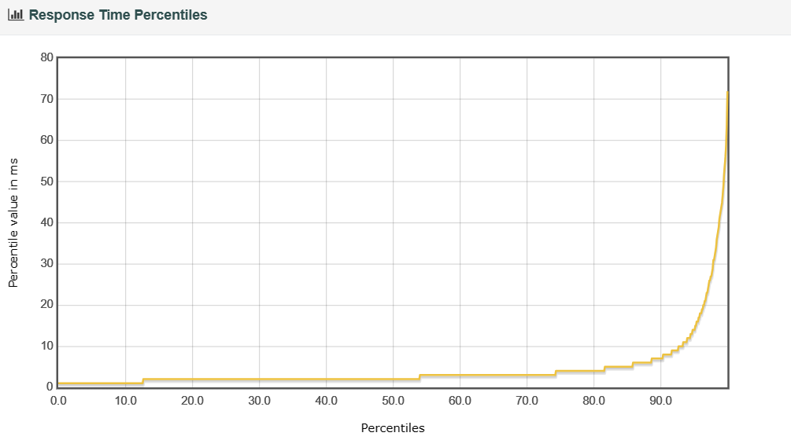
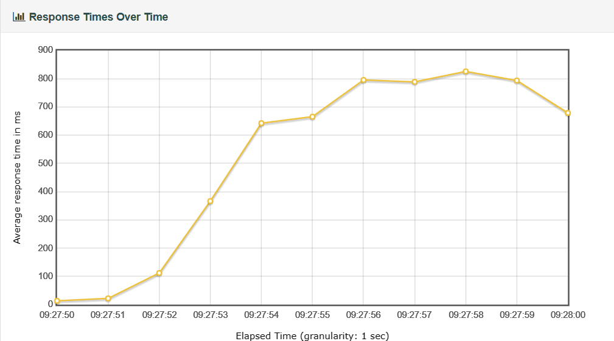

# 实验二：Mongo的读写效率

## 实验预想：

**MongoDB**

- **数据存储方式**：MongoDB是面向文档的数据库，它使用文档的方式存储数据，文档中可以包含任何类型的数据，而且不需要事先定义其结构。这种方式使得MongoDB在存储和查询非结构化数据时更加高效。
- **索引机制**：MongoDB采用了BSON格式对数据进行存储，BSON是一种类JSON的二进制编码格式，它支持对文档中的任何字段进行索引，查询速度非常快。

**基于以上特性，我们认为无论读写，MongoDB的效率都比MySQL应该更加高效。**

## 实验设计：

### 实验环境

**节点**：华东 - 上海 

**服务器：**

- 服务器 A
  - 操作系统：Ubuntu 22.04
  - Dorker
  - Maven
  - git
  - JDK：17
- 服务器 B
  - 操作系统：Ubuntu 22.04
  - Dorker
  - Maven
  - git
  - JMeter 5. 4 .1 
  - JDK：17
- 服务器 C
  - 操作系统：Ubuntu 22.04
  - Mongo 7.0
  - JDK：17

### 实验内容设计：

- 10s：
  1. 找到服务器超限的精确区间
- 100s：
  1. 探究threads的最大值，以减小loop对实验结果的影响
  2. 依据10s结果，找出服务器大致负载超限区间
  3. 在大致区间内，缩小范围，找到服务器超限的精确区间（精度：samples=100左右）
- 总结对比mysql的读写效率，得出结论

## 预处理：

在刚开始进行试验时，我们发现了无论是读还是写的实验，在返回得到的测试结果中均有一些请求失败的结果。

经过不断地尝试，我们发现读实验和写实验中的失败请求有着各自的原因，并修改了读实验的jmx文件，避免了读的失败请求。

**具体细节如下：**

1. 读：
   我们查看了读实验中生成的jtl文件，发现是Id.csv的第一行被作为参数用于发送请求。
   
   
   
   因此解决方案很简单：修改jmx文件，忽略csv的表头即可。
   
   

2. 写：
   
   原因是在程序使用到了雪花算法，而在雪花算法中又使用到了时间戳信息。
   
   
   
   当服务器处于高并发情况下的时候，可能需要在1s内处理超过1000个请求，而雪花算法1ms内只能申请1个id，因此这时就会报错，返回500：Internal Server Error。
   
   

## 实验过程和结果分析：

### 读：

#### 10s：

##### 实验过程：

**（loop=2）**

1. 测出大致区间：4000~5000

注：**T-L-R**指的是**Thread_num - Loop - Ramp_time**。

| T-L-R              | 1000-2-10 | 3000-2-10 | 4000-2-10 | 5000-2-10 |
| ------------------ | --------- | --------- | --------- | --------- |
| Response Time (ms) | 5         | 9         | 5         | 795       |

2. 测出精确区间：

（测试1：11.25）

| T-L-R              | 4500-2-10 | 4600-2-10 | 4700-2-10 | 4800-2-10(KEY) | 4900-2-10(KEY) |
| ------------------ | --------- | --------- | --------- | -------------- | -------------- |
| Response Time (ms) | 46        | 13        | 71        | 69             | 673            |

（测试2：验证实验，11.26）

| T-L-R              | 4700-2-10(KEY) | 4800-2-10(KEY) |
| ------------------ | -------------- | -------------- |
| Response Time (ms) | 33             | 300            |

****

**（loop=4）**

测出精确区间（依据loop=2的实验结果）

（测试1：11.25）

| T-L-R              | 2500-4-10 | 2600-4-10 | 2700-4-10 |
| ------------------ | --------- | --------- | --------- |
| Response Time (ms) | 4         | 4         | 3         |

| T-L-R              | 2800-4-10（KEY) | 2900-4-10(KEY) | 3000-4-10 |
| ------------------ | -------------- | -------------- | --------- |
| Response Time (ms) | 4              | 272            | 287       |

（测试2：验证实验，11.26）

| T-L-R              | 2800-4-10(KEY) | 2900-4-10(KEY) |
| ------------------ | -------------- | -------------- |
| Response Time (ms) | 4              | 453            |

##### 实验分析：

**在loop=2的2次测试中都存在突增问题**：

* 该问题反应在Response Times Over Time中，与Latencies Over Time一致，与connection无关
* 该问题会增大平均response time
* 当服务器负载较小时，突增能较快恢复；在负载较大时，恢复速度慢
* 比较loop2和loop4的情况，发现loop数增大，突增的影响减小

##### 关键数据：

**（loop=2）**

* 4700-2-10

**（Statistics）**

**（over time）**

* 4800-2-10

**（Statistics）**

**（over time）**

****

**（loop=4）**

* 2800-4-10（loop4）

**（Statistics）**

**（Over Time）**

**（Percentages）**

* 2900-4-10（loop4）

**（Statistics）**

**（Over time）**

**（Percentages）**

##### 读实验10s结果总结：

###### （测试1：11.25）

|                        | loop=2  | loop=4  |
| ---------------------- | ------- | ------- |
| 负载上限                   | 4800-10 | 2800-10 |
| 平均每秒线程数（sample(s) / s） | 960     | 1120    |

###### （测试2：11.26）

|                        | loop=2  | loop=4  |
| ---------------------- | ------- | ------- |
| 负载上限                   | 4700-10 | 2800-10 |
| 平均每秒线程数（sample(s) / s） | 940     | 1120    |

* 可以看出：2次实验结果基本相符
* loop增大，读效率增大

#### 100S:

##### 实验过程：

1. 探究threads的最大值，以减小loop对实验结果的影响
   
   根据samples的数量确定
   
   | T-L-R   | 4000-30-100 | 4500-33-100 | 5000-26-100 | 20000-5-100 | 100000-1-100 |
   | ------- | ----------- | ----------- | ----------- | ----------- | ------------ |
   | samples | 120000      | 148500      | 118248      | 27215       | 30538        |
   
   **结论**：threads数应该设置在4000-4500之间，通过loop数控制samples的数量，以进行探究实验；

2. 依据10s结果，找出服务器大致负载超限区间
   
   依据10s的结果，由于JVM程序需要预热，时间增加，减小了预热对于实验结果的影响，故可以在10s结果的平均每秒发出请求数目上增加，以找到服务器工作负载上限的大致区间：
   
   | T-L-R              | 4500-30-100 | 4500-33-100 | 4500-35-100 | 4500-36-100 |
   | ------------------ | ----------- | ----------- | ----------- | ----------- |
   | Response Time (ms) | 5           | 46          | 400         | 500         |
   
   锁定大致区间为samples=（148500-157500）

3. 大致区间内，缩小范围，找到服务器超限的精确区间（精度：samples=100左右）
   
   **精度：samples= 300 左右**
   
   | T-L-R              | 4400-35-100 | 4410-35-100 | 4420-35-100 | 4450-35-100 |
   | ------------------ | ----------- | ----------- | ----------- | ----------- |
   | Response Time (ms) | 15          | 10          | 200         | 300         |
   
   **精度：samples=100左右 KEYDATA**
   
   | T-L-R              | 4410-35-100 | 4411-35-100 | 4413-35-100 | 4415-35-100 |
   | ------------------ | ----------- | ----------- | ----------- | ----------- |
   | Response Time (ms) | 10          | 150         | 351         | 300         |

##### 关键数据：

* 4410-35-100

**（Statistics）**

**（Response Time Percentiles）**

**（Response Times Over Time）**

* 4411-35-100

**（Statistics）**

**（Response Time Percentiles）**

**（Response Times Over Time）**

#### 读实验结果：

**服务器负载上限**

|                        | 10s  | 100s |
|:----------------------:|:----:|:----:|
| **MogoDB**（samples /s） | 1120 | 1544 |
| **Mysql**（samples /s）  | 150  | 183  |

#### 读实验结论：

1. 相比MySQL，MongoDB的读效率提高了大致8.43倍，效果相当明显。

2. 延长测试时间之后，测得服务器的负载上限也有所提升。

### 写：

#### 10s:

##### 实验过程：

**（loop=2）**

1. 测出大致区间：5000~7000

| T-L-R              | 5000-2-10 | 6000-2-10 | 7000-2-10 |
| ------------------ | --------- | --------- | --------- |
| Response Time (ms) | 10        | 12        | 400       |

2. 测出精确区间：

| T-L-R              | 6500-2-10 | 6600-2-10 | 6700-2-10 |
| ------------------ | --------- | --------- | --------- |
| Response Time (ms) | 5         | 10        | 300       |

##### 关键数据：

* 6600-2-10

**（Statistics）**

**（Response Times over time）**

**(Response Time Percentiles)**

**(Active Threads Over Time)**

* 6700-2-10s

**（Statistics）**

**（Response Times over time）**

**(Response Time Percentiles)**

**(Active Thread Over Time)**

#### 100S:

##### 实验过程：

1. 探究loop20-100s
   
   **samples**
   
   | T-L-R   | 9500-20-100 | 9750-20-100 |
   | ------- | ----------- | ----------- |
   | samples | 95300       | 95200       |
   
   **响应时间**
   
   | T-L-R              | 9500-20-100 | 9750-20-100 |
   | ------------------ | ----------- | ----------- |
   | Response Time (ms) | 24          | 500         |
   
   **结论**：sample数小于9500\*20，**测试机没法发出全部请求**；但95300个sample-100s大概是服务器极限。**因此后面采用loop=40进行正式实验**。

2. 探究loop40-100s
   
    **samples**
   
   | T-L-R   | 3450-40-100 | 4000-40-100 | 4350-40-100 | 4450-40-100 | 5000-40-100 |
   | ------- | ----------- | ----------- | ----------- | ----------- | ----------- |
   | samples | 138000      | 160000      | 174000      | 178000      | 179960      |
   
   **结论**：测试机无法超过100s内5000\*40个sample，100s内4450\*40接近测试机发出请求上限。
   
   **响应时间**

| T-L-R              | 4000-40-100 | 4350-40-100 | 4450-40-100 | 4750-40-100 |
| ------------------ | ----------- | ----------- | ----------- | ----------- |
| Response Time (ms) | 9           | 14          | 18          | 400         |

##### 关键数据：

* 4450-40-100

**（Statistics）**

**（Response Time Percentiles）**

**（Response Times Over Time）**

* 4750-40-100

**（Statistics）**

**（Response Time Percentiles）**

**（Response Times Over Time）**

#### 写实验结果：

**服务器负载上限**

|                          | 10s  | 100s |
|:------------------------:|:----:|:----:|
| **MogoDB** (samples / s) | 1320 | 1780 |
| **Mysql** (samples / s)  | 400  | 400  |

#### 结果分析：

100s测得的服务器负载上限比10s的结果更好，可能是由于100s的实验中相较于10s的实验loop数更多，单次loop发的数据量更小，因此服务器压力会更低。 

#### 写实验结论：

1. 相比于MySQL，MongoDB的读效率提高了大致4.45倍，效果相当明显。

2. 延长测试时间之后，测得服务器的负载上限也有所提升。

## 附录：

### 实验数据：

本次实验数据与使用到的脚本均同步上传至git仓库：[GitHub - impAcreat/JavaEE-Experiment2](https://github.com/impAcreat/JavaEE-Experiment2/)。

### 实验中的其他发现：

#### 现象：

我们在实验过程中还发现了当mongo的**服务器负载压力接近极限时，反应时间并没有像mysql一样稳定下来，而是会上下波动**。

更详细地说明见下方：

* 在loop35-100s进行测试，可以发现：
  
  * 在低负载时，反应时间保持稳定
  
  * 接近负载极限，反应时间出现比较大幅的波动
  
  * 超过极限，反应时间变大，且随测试时间增长而变大
  
  * 反应时间的波动现象：
    
    

* 之前在loop2-10s出现的突变也得到了解释：
  
  * 回去看之前的实验数据，可以发现在低负载时，并不存在突变，突变在接近极限时才出现
  
  * 突变：
    
    

* loop20-100s：
  
  * 存在thread创建限制，创建的线程数在4500-4600（测试线程数在4800-7500），故极限samples数在100000左右
  * loop数较小时，实验结果更为明显

#### 关键数据截图：

* 3000-35-100

**（Statistics）**

**（Over Time）**

* 4000-35-100

**（Statistics）**

**（Over Time）**

* 4300-35-10

**（Statistics）**

**（Over Time）**

* 4450-35-100

**（Statistics）**

**（Over Time）**

****

* 3000-2-10

**（Statistics）**

**（Over Time）**

* 4600-2-10

**（Over Time）**

* 5000-2-10

**（Over time）**

---

* 5800-20-100

**（Statistics）**

**（Over Time）**

* 7000-20-100

**（Statistics）**

**（Over Time）**

* 7500-20-100

**（Statistics）**

**（Over Time）**

